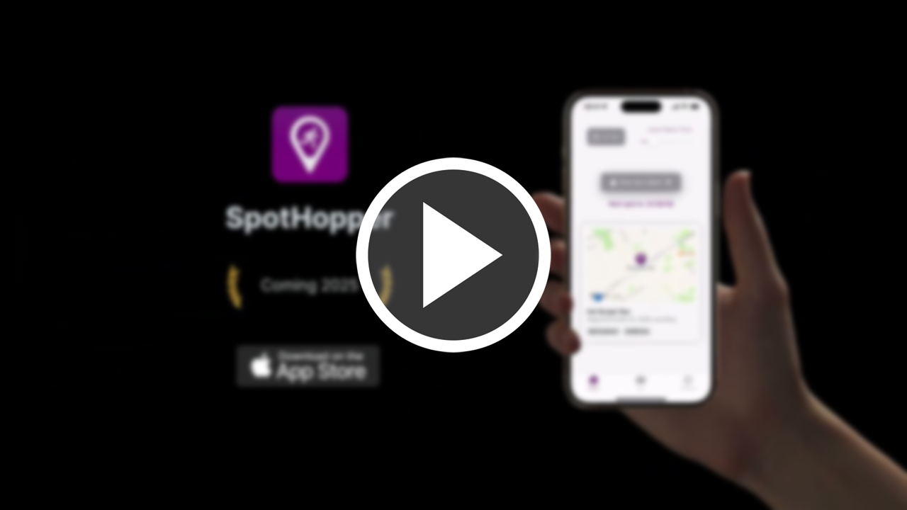
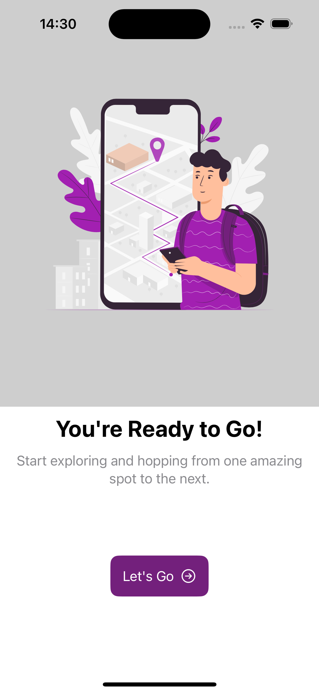
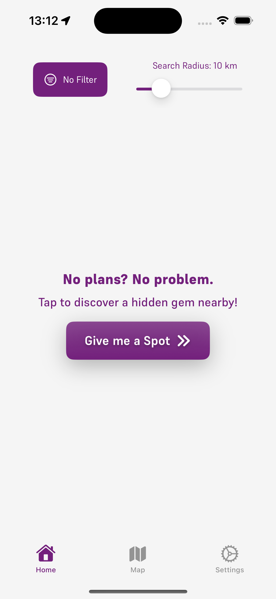
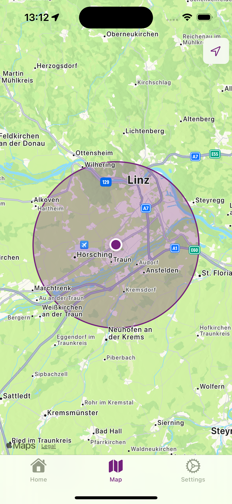
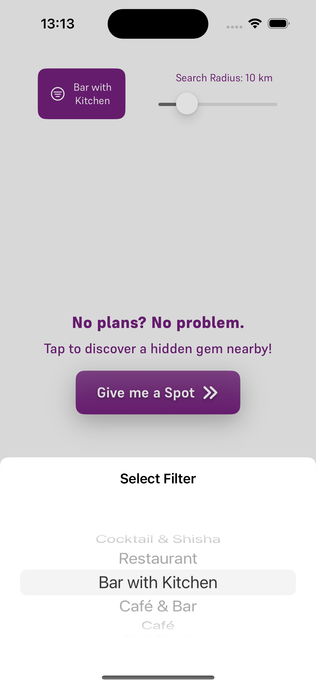
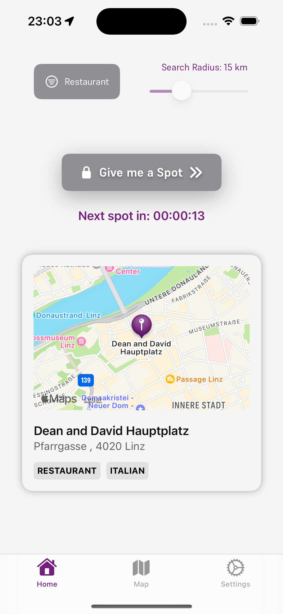
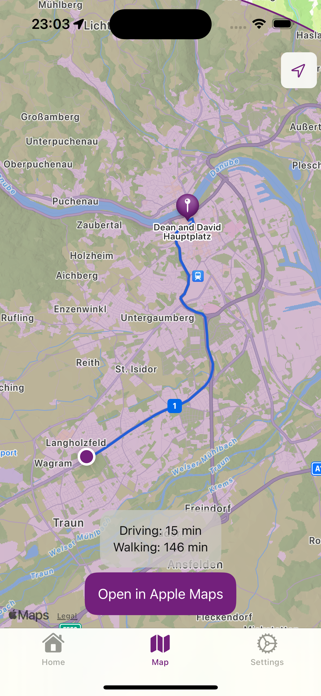

# SpotHopper

SpotHopper is an innovative mobile app that provides personalized, location-based recommendations for venues where users can enjoy quality time with friends. 
The app offers fresh suggestions every 24 hours, ensuring users always have exciting new spots to explore, whether it’s a restaurant, café, bar, or hidden gem in their city.

This app is developed as part of our Bachelor’s thesis project and will soon be available on the App Store. SpotHopper brings together powerful location-based services, sleek design, and user-friendly functionality.

## Key Features
- **Daily Recommendations**: Receive hand-picked venue recommendations every 24 hours based on your location.
- **Personalized Experience**: Answer a few simple questions to get recommendations tailored to your preferences.
- **Map Integration**: Seamless integration with MapKit allows users to quickly locate suggested venues on the map.
- **Smooth Navigation**: A user-friendly interface built with SwiftUI ensures intuitive and engaging interactions.

## Project Status
This project is under active development as part of our Bachelor’s thesis at FH Hagenberg. The frontend development is led by [Benjamin Golić](https://github.com/benjamingolic), focusing on the user interface and in-app logic, while the backend is handled by [Teodor Brankovic](https://github.com/teodorbrankovic), who manages the Firebase integration and data management.

We plan to release SpotHopper on the App Store in 2025, continuing to iterate and enhance the app’s features based on user feedback and further technical development.

## Technical Stack
SpotHopper is a modern SwiftUI app, utilizing various technologies and frameworks:
- **SwiftUI**: For building the user interface.
- **MapKit**: For displaying venues on a map.
- **Firebase**: Backend services for real-time data storage, authentication, and analytics.
- **GeoJSON**: To handle location-based queries and retrieve venue data efficiently.

## The Development Journey
Our development journey started with a strong division of responsibilities:
- **Frontend**: Developed by Benjamin, focusing on the entire user interface, animation, and in-app logic, making sure that users can seamlessly interact with the app.
- **Backend**: Developed by Teodor, focusing on setting up and maintaining Firebase, handling real-time data syncing, and ensuring secure communication between the app and the database.

Together, we’ve combined our expertise to create a smooth, fast, and responsive app that prioritizes user experience and functionality.

## Promo Video

Check out the promo video for SpotHopper, created by [Benjamin Golić](https://github.com/benjamingolic) using After Effects:

  

## Screenshots

    
    
    
    
    
    

## What’s Next?
While the core features of SpotHopper are already functional, we continue working on refining the app and expanding its capabilities as part of our Bachelor’s thesis. As we continue developing, we aim to enhance the personalized recommendation system and add new exciting features to keep users engaged.

Stay tuned for the release on the App Store in 2025!

## License

This project is licensed under the **All Rights Reserved** license. The code in this repository is not available for public use, distribution, or modification, as the app is planned for a release on the App Store in 2025. This repository is made public solely for showcasing purposes during our application process to companies.

Please respect that any use of this code without explicit permission is prohibited.
